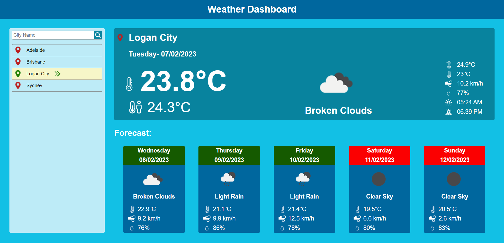
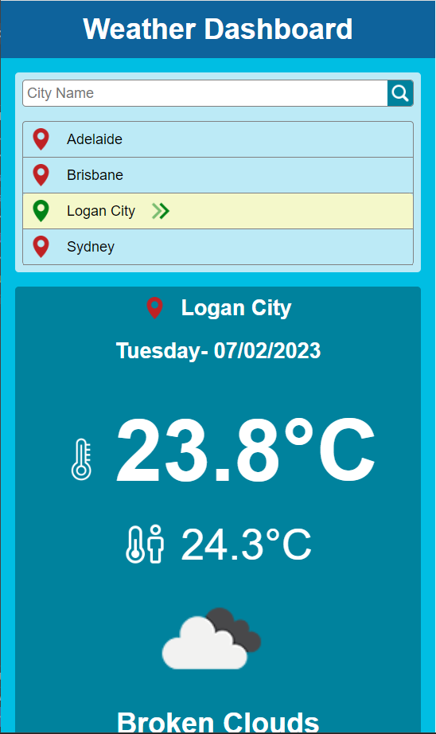

# Weather-Dashboard
Weather Dashboard for multiple cities.

## Made With

## Description
Weather dashboard displaying current and future weather forecast for multiple cities.
- When the page loads, ask user to share the current location.
- If user accepts to share the location, displays current location weather information as default location.
- If user denies to share the location, disaplays weather information for Sydney, Australia as default location.
- The main dashboard displays city or current location name, present day and date, current weather condition by displaying current temperature, feels like temperature, icon representation of weather condition and description, maximum and minimum temperatures, wind speed, humidity sunrise and sunset in local times.
- User is also presented with 5 day forecast that displays day, date, icon representation of weather condition and description, temperature, wind speed and humidity.
- Highlights weekend days with red background color. 
- The city name is added to search city list.
- When user searches for a city, current and future weather information for seached city is displayed.
- The city name is added to to search city list.
- When user clicks on a city name from search city list, current and future weather information for the selected city is displayed.

## Deployment
The webpage is deployed to GitHub pages. Use below link to visit the webpage: https://nileshpatel83.github.io/Weather-Dashboard/

## Screenshots
The page resembles as following on desktop:

The page resembles as following on mobile:

## License
Please refer to the LICENSE in the repo.